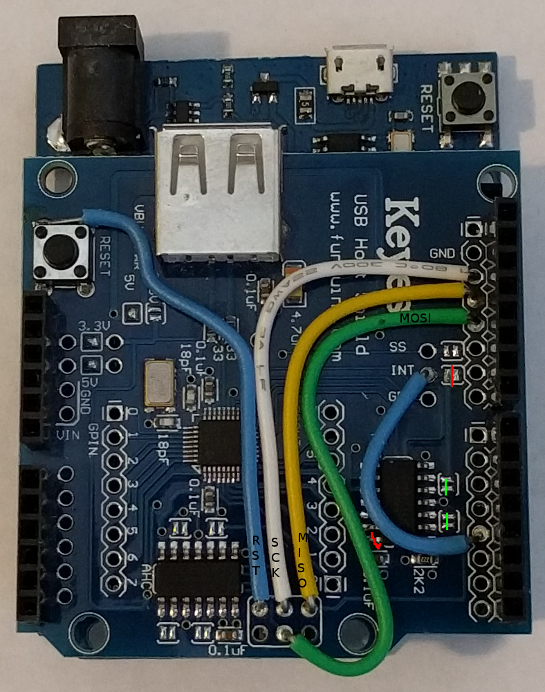
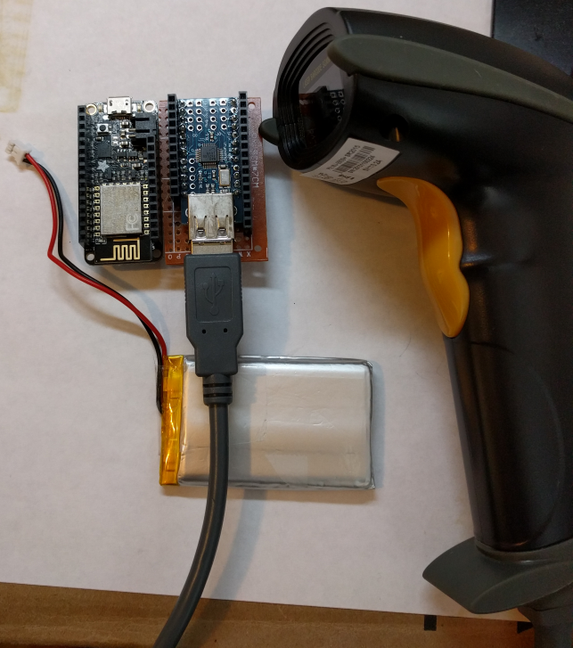

# ESP8266 USB host demos

WiFi-enable a wide variety of USB devices using an ESP8266 and
a USB host shield. For example, add a WiFi interface to a USB barcode
reader or a USB RFID keyfob reader.

The WeMos D1 R2 board appeared to be the ideal board to use with a USB host
shield. The D1 is built around an ESP8266 and is laid out like an Arduino Uno.
However, the D1 does not have an ICSP connector so this prevents the USB host
shield board from working. This can be fixed with some modifications to the USB
host shield board. The hardware build details are on the
[wiki](https://github.com/gdsports/esp8266-usb-host-demos/wiki).

If you want to get small and battery powered, the Adafruit Huzzah Feather and
USB host mini board are made for each other. Actually, no, but with a few
modifications, they can talk to each other. This combo is much smaller than
the D1 and USB host shield. The hardware build details are on the
[wiki](https://github.com/gdsports/esp8266-usb-host-demos/wiki).

The example programs run on the D1 and the Feather. The programs are designed
to work with devices that look like USB keyboards. This includes keyboards as
well as barcode scannners and simple RFID keyfob scanners. usbkbdwifi
implements a TCP server on port 23. A client such as netcat (nc) can connect
to the barcode scanner like this: `nc <ESP IP address> 23`. usbkbdpost 
does an HTTP POST to a test HTTP server when a barcode is scannned.
